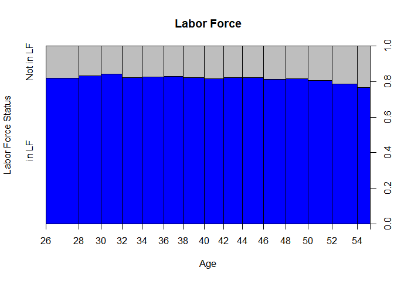

Homework 6, Lab 6, Econ B2000
================
Nicole Kerrison & Christopher Tinevra
11/9/2020

#### Lab Results for Lab 6 “Logic and Probit Models”

``` r
load("~/CCNY/Graduate School/Fall 2020/Econometrics/ACS Data for R/acs2017_ny_data.RData")
suppressMessages(attach(acs2017_ny))
```

``` r
acs2017_ny$EMPSTAT <- as.factor(acs2017_ny$EMPSTAT)
levels(acs2017_ny$EMPSTAT) <- c("NA","Employed","Unemployed","Not in LF")

acs2017_ny$LABFORCE <- as.factor(acs2017_ny$LABFORCE)
levels(acs2017_ny$LABFORCE) <- c("NA","Not in LF","in LF")

acs2017_ny$MARST <- as.factor(acs2017_ny$MARST)
levels(acs2017_ny$MARST) <- c("married spouse present","married spouse absent","separated","divorced","widowed","never married")

table(acs2017_ny$EMPSTAT,acs2017_ny$LABFORCE)
```

    ##             
    ##                 NA Not in LF in LF
    ##   NA         33427         0     0
    ##   Employed       0         0 93482
    ##   Unemployed     0         0  4954
    ##   Not in LF      0     64722     0

``` r
acs2017_ny$age_bands <- cut(acs2017_ny$AGE,breaks=c(0,25,35,45,55,65))
table(acs2017_ny$age_bands,acs2017_ny$LABFORCE)
```

    ##          
    ##              NA Not in LF in LF
    ##   (0,25]  31680     11717 13256
    ##   (25,35]     0      4271 20523
    ##   (35,45]     0      4064 18924
    ##   (45,55]     0      5406 21747
    ##   (55,65]     0     10563 18106

Tables demonstrates the total amount of people from the dataset that are
part of the labor force. Additionally, the people are divided into age
categories ranging from 25 to 65 years old and the amount of people that
are part of the labor force by age group.

``` r
use_varb <- (acs2017_ny$AGE >25) & (acs2017_ny$AGE <= 55)
acs2017_ny$LABFORCE <- as.factor(acs2017_ny$LABFORCE)
dat_use <- subset(acs2017_ny,use_varb)
dat_use$LABFORCE <- droplevels(dat_use$LABFORCE) 
model_logit <- glm(LABFORCE ~ AGE ,family = binomial, data = dat_use)
model_probit <- glm(LABFORCE ~ AGE ,family = binomial (link = 'probit'), data = dat_use)

summary(dat_use$LABFORCE)
```

    ## Not in LF     in LF 
    ##     13741     61194

``` r
suppressMessages(require(stargazer))
stargazer(model_logit, model_probit, type = "text")
```

    ## 
    ## ==============================================
    ##                       Dependent variable:     
    ##                   ----------------------------
    ##                             LABFORCE          
    ##                      logistic       probit    
    ##                        (1)            (2)     
    ## ----------------------------------------------
    ## AGE                 -0.009***      -0.005***  
    ##                      (0.001)        (0.001)   
    ##                                               
    ## Constant             1.865***      1.111***   
    ##                      (0.045)        (0.025)   
    ##                                               
    ## ----------------------------------------------
    ## Observations          74,935        74,935    
    ## Log Likelihood     -35,668.060    -35,668.250 
    ## Akaike Inf. Crit.   71,340.120    71,340.510  
    ## ==============================================
    ## Note:              *p<0.1; **p<0.05; ***p<0.01

``` r
NNobs <- length(dat_use$LABFORCE)
set.seed(12345) 
graph_obs <- (runif(NNobs) < 0.8)
dat_graph <-subset(dat_use,graph_obs)  
 plot(LABFORCE ~ AGE, pch = 16, ylim = c(0,1), data = dat_graph, main = "Labor Force", xlab = "Age", ylab = "Labor Force Status", col = c("blue","gray"))
```

<!-- -->

The following lab model illustrates a simple probit and logit non linear
regression where the dependent variable is the labor force participation
and the indenpent variable is age.

``` r
model_logit1 <- glm(LABFORCE ~ AGE + I(AGE^2) + female + AfAm + Asian + race_oth + Hispanic+ educ_hs + educ_somecoll + educ_college + educ_advdeg + MARST, family = binomial, data = dat_use)

model_probit1 <- glm(LABFORCE ~ AGE + I(AGE^2) + female + AfAm + Asian + race_oth + Hispanic+ educ_hs + educ_somecoll + educ_college + educ_advdeg + MARST, family = binomial (link = 'probit'), data = dat_use)

suppressMessages(require(stargazer))
stargazer(model_logit1, model_probit1, type = "text")
```

    ## 
    ## =======================================================
    ##                                Dependent variable:     
    ##                            ----------------------------
    ##                                      LABFORCE          
    ##                               logistic       probit    
    ##                                 (1)            (2)     
    ## -------------------------------------------------------
    ## AGE                            0.017          0.010    
    ##                               (0.012)        (0.007)   
    ##                                                        
    ## I(AGE2)                      -0.0003**      -0.0002**  
    ##                               (0.0001)      (0.0001)   
    ##                                                        
    ## female                       -0.684***      -0.398***  
    ##                               (0.021)        (0.011)   
    ##                                                        
    ## AfAm                         -0.191***      -0.112***  
    ##                               (0.028)        (0.016)   
    ##                                                        
    ## Asian                        -0.111***      -0.074***  
    ##                               (0.037)        (0.021)   
    ##                                                        
    ## race_oth                      -0.078**      -0.044**   
    ##                               (0.033)        (0.019)   
    ##                                                        
    ## Hispanic                      0.165***      0.087***   
    ##                               (0.031)        (0.018)   
    ##                                                        
    ## educ_hs                       0.897***      0.542***   
    ##                               (0.031)        (0.019)   
    ##                                                        
    ## educ_somecoll                 1.453***      0.858***   
    ##                               (0.035)        (0.021)   
    ##                                                        
    ## educ_college                  1.943***      1.123***   
    ##                               (0.037)        (0.021)   
    ##                                                        
    ## educ_advdeg                   2.368***      1.339***   
    ##                               (0.044)        (0.024)   
    ##                                                        
    ## MARSTmarried spouse absent   -0.522***      -0.304***  
    ##                               (0.052)        (0.030)   
    ##                                                        
    ## MARSTseparated                -0.124**      -0.069**   
    ##                               (0.058)        (0.033)   
    ##                                                        
    ## MARSTdivorced                  0.062*         0.034    
    ##                               (0.038)        (0.021)   
    ##                                                        
    ## MARSTwidowed                 -0.302***      -0.182***  
    ##                               (0.093)        (0.055)   
    ##                                                        
    ## MARSTnever married           -0.386***      -0.215***  
    ##                               (0.024)        (0.014)   
    ##                                                        
    ## Constant                      0.602**       0.359***   
    ##                               (0.245)        (0.138)   
    ##                                                        
    ## -------------------------------------------------------
    ## Observations                   74,935        74,935    
    ## Log Likelihood              -32,423.320    -32,407.920 
    ## Akaike Inf. Crit.            64,880.640    64,849.840  
    ## =======================================================
    ## Note:                       *p<0.1; **p<0.05; ***p<0.01

``` r
detach()
```

Model 1 illustrates a probit and logit non linear regression with
multiple independent variables. These independent variables may have an
effect on whether a person participates in the labor force or not.

Using the coefficient estimates from logic and probit model, we can
predict various probabilities while using independent variables and
keeping labor force as the dependent variable.

For example, using the logic model we can predict the probability of a
35 year old female with an advanced degree within the labor force
considering the independent variables as AGE, AGE^2, FEMALE, and
EDUC\_ADV.

The following functions provides the probability prediction using the
relevant coefficients and setting other independent variables to zero
since its not applicable to the analysis.

``` r
1/(1+(exp(-(0.602 + (0.017)*(35) + (-0.0003)*(35^2) + (-0.684*1) + (2.368*1)))))
```

    ## [1] 0.9250828

For the logic model, the predicted probability for a 35 year old female
with an advanced degree to be part of the labor force is 92.51%

Another example, using the probit model we can predict the probability
of a 35 year old female with an advanced degree within the labor force
considering the independent variables as AGE, AGE^2, FEMALE, and
EDUC\_ADV.

``` r
pnorm(0.602 + (0.017)*(35) + (-0.0003)*(35^2) + (-0.684*1) + (2.368*1))
```

    ## [1] 0.994023

For the probit model, the predicted probability for a 35 year old female
with an advanced degree to be part of the labor force is 99.40%

When comparing the probabilities calculated from the probit and logit
model, the difference is 6.89 percentage points. The probit model shows
a stronger predictability of determining whether a female with a
advanced degree is part of the labor force.

Furthermore, the logic and probit models can be further expanded by
adding additional independent variables into the Generalized non-linear
Models while maintaining Labor force as the dependent variable. In this
case, we will be taking a look at the citizen status as the independent
variable.

``` r
suppressMessages(attach(acs2017_ny))

acs2017_ny$LABFORCE <- as.factor(acs2017_ny$LABFORCE)
levels(acs2017_ny$LABFORCE) <- c("NA","Not in LF","in LF")

acs2017_ny$MARST <- as.factor(acs2017_ny$MARST)
levels(acs2017_ny$MARST) <- c("married spouse present","married spouse absent","separated","divorced","widowed","never married")

acs2017_ny$CITIZEN <- as.factor(acs2017_ny$CITIZEN)
levels(acs2017_ny$CITIZEN) <- c("Born abroad of American parents", "Naturalized citizen", "Not a citizen", "Not a citizen, but has received first papers", "Foreign born, citizenship status not reported")
```

``` r
use_varb1 <- (acs2017_ny$AGE >25) & (acs2017_ny$AGE <= 55)

dat_use2 <- subset(acs2017_ny, use_varb1)

dat_use2$LABFORCE <- droplevels(dat_use2$LABFORCE)
dat_use2$MARST <- droplevels(dat_use2$MARST)
dat_use2$CITIZEN <- droplevels(dat_use2$CITIZEN)

model_logit2 <- glm(LABFORCE ~ AGE + I(AGE^2) + female + AfAm + Asian + race_oth + Hispanic + educ_hs + educ_somecoll + educ_college + educ_advdeg + MARST +CITIZEN, family = binomial, data = dat_use2)

model_probit2 <- glm(LABFORCE ~ AGE + I(AGE^2) + female + AfAm + Asian + race_oth + Hispanic + educ_hs + educ_somecoll + educ_college + educ_advdeg + MARST+ CITIZEN, family = binomial (link = 'probit'), data = dat_use2)

suppressMessages(require(stargazer))
stargazer(model_logit2, model_probit2, type = "text")
```

    ## 
    ## ================================================================================
    ##                                                         Dependent variable:     
    ##                                                     ----------------------------
    ##                                                               LABFORCE          
    ##                                                        logistic       probit    
    ##                                                          (1)            (2)     
    ## --------------------------------------------------------------------------------
    ## AGE                                                     0.012          0.008    
    ##                                                        (0.012)        (0.007)   
    ##                                                                                 
    ## I(AGE2)                                                -0.0003*      -0.0002**  
    ##                                                        (0.0001)      (0.0001)   
    ##                                                                                 
    ## female                                                -0.694***      -0.403***  
    ##                                                        (0.021)        (0.011)   
    ##                                                                                 
    ## AfAm                                                  -0.266***      -0.150***  
    ##                                                        (0.029)        (0.017)   
    ##                                                                                 
    ## Asian                                                 -0.296***      -0.162***  
    ##                                                        (0.041)        (0.023)   
    ##                                                                                 
    ## race_oth                                              -0.133***      -0.070***  
    ##                                                        (0.034)        (0.019)   
    ##                                                                                 
    ## Hispanic                                               0.106***      0.061***   
    ##                                                        (0.033)        (0.018)   
    ##                                                                                 
    ## educ_hs                                                0.890***      0.535***   
    ##                                                        (0.031)        (0.019)   
    ##                                                                                 
    ## educ_somecoll                                          1.449***      0.851***   
    ##                                                        (0.036)        (0.021)   
    ##                                                                                 
    ## educ_college                                           1.935***      1.114***   
    ##                                                        (0.037)        (0.022)   
    ##                                                                                 
    ## educ_advdeg                                            2.365***      1.334***   
    ##                                                        (0.044)        (0.024)   
    ##                                                                                 
    ## MARSTmarried spouse absent                            -0.526***      -0.304***  
    ##                                                        (0.052)        (0.030)   
    ##                                                                                 
    ## MARSTseparated                                         -0.111*        -0.061*   
    ##                                                        (0.058)        (0.033)   
    ##                                                                                 
    ## MARSTdivorced                                          0.075**        0.041*    
    ##                                                        (0.038)        (0.021)   
    ##                                                                                 
    ## MARSTwidowed                                          -0.301***      -0.182***  
    ##                                                        (0.094)        (0.055)   
    ##                                                                                 
    ## MARSTnever married                                    -0.351***      -0.198***  
    ##                                                        (0.024)        (0.014)   
    ##                                                                                 
    ## CITIZENNaturalized citizen                              0.112          0.050    
    ##                                                        (0.099)        (0.055)   
    ##                                                                                 
    ## CITIZENNot a citizen                                   0.465***      0.247***   
    ##                                                        (0.035)        (0.019)   
    ##                                                                                 
    ## CITIZENNot a citizen, but has received first papers    0.081**         0.015    
    ##                                                        (0.034)        (0.019)   
    ##                                                                                 
    ## Constant                                               0.707***      0.415***   
    ##                                                        (0.245)        (0.138)   
    ##                                                                                 
    ## --------------------------------------------------------------------------------
    ## Observations                                            74,935        74,935    
    ## Log Likelihood                                       -32,325.830    -32,313.940 
    ## Akaike Inf. Crit.                                     64,691.670    64,667.890  
    ## ================================================================================
    ## Note:                                                *p<0.1; **p<0.05; ***p<0.01

``` r
detach()
```

Model 2 illustrates a probit and logit non linear regression with
multiple independent variables but this time taking into consideration
citizen status. Using the coefficient estimates from logic and probit
model 2, we can predict probabilities whether naturalize citizens and
non citizens participate in the labor force.

For the logic model we can predict the probability of a 35 year old
female naturalized citizen and non citizen with an college degree
participates in the labor force while considering the independent
variables as AGE, AGE^2, FEMALE, EDUC\_COLLEGE, CITIZENNaturalized
citizen and CITIZENNot a citizen.

The following functions provides the probability prediction using the
relevant coefficients and setting other independent variables to zero
since its not applicable to the analysis.

``` r
1/(1+(exp(-(0.707 + (0.012)*(35) + (-0.0003)*(35^2) + (-0.694*1) + (1.935*1) + (0.112*1)))))
```

    ## [1] 0.8921122

For the logic model, the predicted probability for a 35 year old female
naturalized citizen with an college degree to be part of the labor force
is 89.21%

``` r
1/(1+(exp(-(0.707 + (0.012)*(35) + (-0.0003)*(35^2) + (-0.694*1) + (1.935*1) + (0.465*1)))))
```

    ## [1] 0.9216876

For the logic model, the predicted probability for a 35 year old female
non citizen with an college degree to be part of the labor force is
92.17%

For the probit model we can predict the probability of a 35 year old
female naturalized citizen and non citizen with an college degree
participates the labor force considering the independent variables as as
AGE, AGE^2, FEMALE, EDUC\_COLLEGE, CITIZENNaturalized citizen and
CITIZENNot a citizen.

``` r
pnorm(0.707 + (0.012)*(35) + (-0.0003)*(35^2) + (-0.694*1) + (1.935*1) + (0.112*1))
```

    ## [1] 0.9826782

For the probit model, the predicted probability for a 35 year old female
naturilized citizen with an college degree to be part of the labor force
is 98.27%

``` r
pnorm(0.707 + (0.012)*(35) + (-0.0003)*(35^2) + (-0.694*1) + (1.935*1) + (0.465*1))
```

    ## [1] 0.9931589

For the probit model, the predicted probability for a 35 year old female
non citizen with an college degree to be part of the labor force is
99.32%

When comparing the probabilities calculated from the logit model 2,
there is a 3 percentage point difference for women with college degrees
as a naturalized citizen compared to women of the same parameters that
are non citizens.

When comparing the probabilities calculated from the probit model 2,
there is a 1.05 percentage point difference for women with college
degrees as a naturalized citizen compared to women of the same
parameters that are non citizen.

Lastly, when comparing the probabilities calculated from the probit and
logit model 2, the difference is 9.06 percentage points for naturalized
citizens and 7.15 percentage points for non citizens. The probit model
shows a stronger predictability of determining whether a female either
with naturalized citizen ornon citizen status with a college degree is
part of the labor force.

``` r
#modellin <- lm(LABFORCE ~ AGE + I(AGE^2) + female + AfAm + Asian + race_oth + Hispanic + educ_hs + educ_somecoll + educ_college + educ_advdeg + MARST +CITIZEN, data = dat_use2)
#summary(modellin)
```

Finally, when running the OLS model for the variables used in the probit
and logit model 2, we encounter an error message since the dependent
variable is binary and not numeric. Therefore, a logic and probic model
is ideal to anaylze a non linear relationship for labor force and
independent variables that are non numeric like citizen status or
marital status.

#### Review of Research Articles

Reading below done by: Christopher Tinevra

Research Article 1 Title: “Work from Home After the COVID-19 Outbreak”

Authors: Alexander Bick, Adam Blandin, and Karel Mertens.

The research article emphasizes the recent changes to the workforce due
the effect caused by the current global pandemic. Indeed, the research
illustrates a shift from the regular workplace to remote work following
the advice and mandates set by government officials. Furthermore, the
results which were estimated from a sample size of 5,000 workers shows
that majority of the workers can effectively shift and work from home.
The econometric techniques used in the research include linear
regression models where a correlation was formed in Figure 1 plotting a
positive regression lines for the change of remote working by various
industries. Additionally, multiple combine statistic tables further
illustrate the change in commuting to work, changes in employment, and
workers characteristics pre-pandemic and post-pandemic. In conclusion,
the research provides potential evidence of the effect of the pandemic
on the workforce by changing the workplace to a remote home setting for
most workers depending on industry business and the possible job losses
since the beginning of the outbreak.

Reference: Bick, Alexander and Blandin, Adam and Mertens, Karel, Work
from Home after the Covid-19 Outbreak (June, 2020). FRB of Dallas
Working Paper No. 2017, Available at
SSRN: <https://ssrn.com/abstract=3638737> or <http://dx.doi.org/10.24149/wp2017>

Research Article 2 Title: “Who Telecommutes? Where is the Time Saved
Spent?”

Authors: Harley Frazis

In this research paper, the growth of telecommuting is examined while
taking into consideration ACS data that has illustrated a yearly
increase in the number of workers that work from home in the last 15
years. Furthermore, the result estimates were gathered from the sample
size of approximate 10,000 respondents with continues data responses
ranging from the years 2003 to 2018 through the use of the American Time
Use Survey. The methodology of the research paper includes two main
approaches including simple comparison between the commuting and
non-commuting workdays for the workers, while also comparing the time
use or allocated by telecommuters to non-telecommuters. By using
regression analysis, the paper demonstrates the further growth of
telecommuting as well as how time is reallocated in comparison with time
spend on commuting to work. In conclusion, the research paper provided
some interesting findings showing the estimate of reallocated time for
telecommuters is majorly spent on leisure while also illustrating the
continue growth of telecommuting in recent years from the typical
commuting to workplace jobs.

Reference: Frazis, H. (2020). Who telecommutes? Where is the time saved
spent?. BLS. Available at:
<https://www.bls.gov/osmr/research-papers/2020/ec200050.htm>

Reading below done by: Nicole Kerrison

Research Article 1 Title: “Covid 19 mortality is Negatively Associated
with Test Number and Government Effectiveness”

Authors: Li‑Lin Liang, Ching‑HungTseng , Hsiu J. Ho & Chun‑Ying Wu

This study aims to identify why the mortality rate of Covid-19 is varied
across nations. While it is clear that there is a correlation with
preexisting condition and age with mortality rate, other factors must be
contributing to the variation in mortality rate across the world. Data
was selected from the “Worldometer website” which list the coronavirus
cases and mortality rates for all countries and pulls data from multiple
sources (WHO, US Center for Disease Control, and Computational Health
Informatics at Harvard). Data was pulled from website and used as of
June 13, 2020. Variable for Covid mortality was used and log transformed
to make the data conform to a normal distribution and the regression
analysis is ran using Stata software. A linear regression analysis was
conducted across Covid-19 mortality rate and it was determined that its
negatively associated with Covid-19 test number per 100 people,
government effectiveness score, and number of hospital beds. The study
also revealed that the Covid-19 mortality rate was positively associated
with proportion of population aged 65 or older and transport
infrastructure quality score.

Journal: Scientific Reports www.nature.com/scietificreports

Research Article 2 Title: “An Ecological Study of Socioeconomic
Predictors in Detection of COVID-19 Cases Across Neighborhoods in New
York City”

Authors: Richard S Whittle and Ana Diaz-Artiles

This study aims to analyze the positive COVID-19 cases across the 5
boroughs of New York City since NYC became the epicenter of the virus in
the United States. It seems that certain neighborhoods are experiencing
more cases than others and this paper attempts to explain this by
looking at socioeconomic differences in these boroughs. By using spatial
modeling techniques and regression analysis, they could determine if key
factors (Race, population density, income, and youth population) could
predict clusters of positive tests.They collected data from the Zip Code
Tabulation Areas (ZCTA) and used Bayesian Besag-York- Mollie (BYM)
models where COVID-9 tests were the outcome. From there, they included a
set of 11 demographics and parameters associated with the ZCTA in order
to predict areas where COVID-19 prevalence would be. The study
determined that there is a significant correlation between COVID-19
positive test rate and neighborhoods with a large percentage youth
population, neighborhoods that are predominately Black, and low-income
areas.

Journal: BMC Medicine <https://doi.org/10.1186/s12916-020-01731-6>
